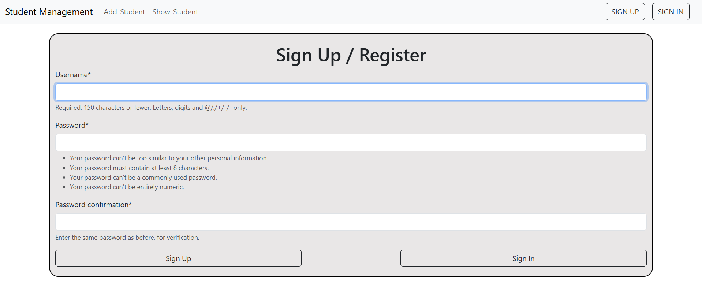
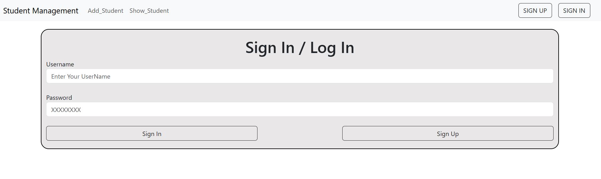
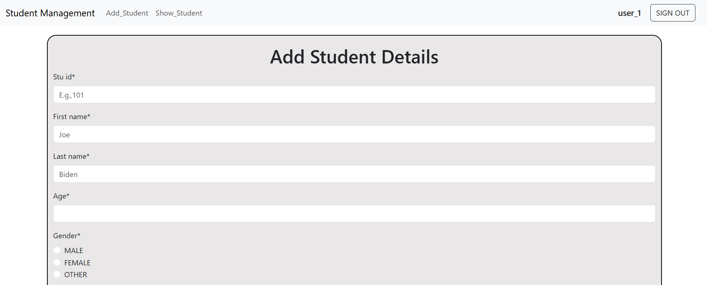
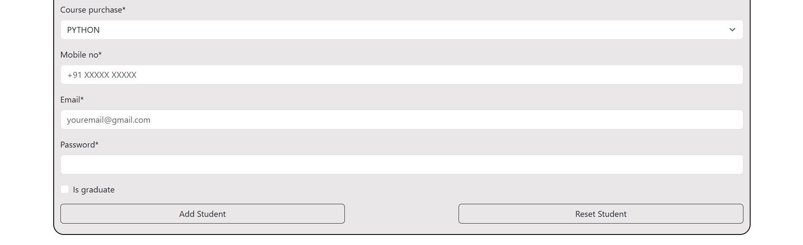
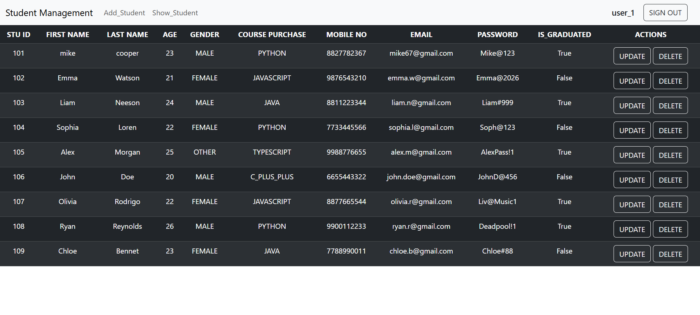
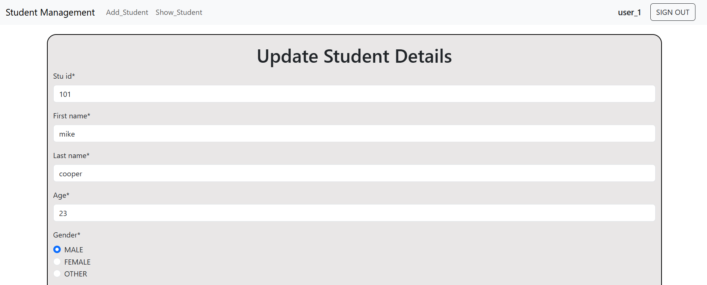
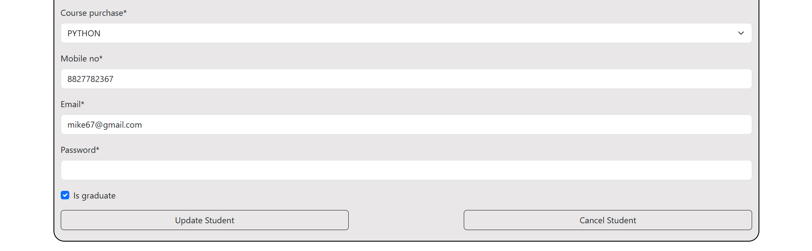
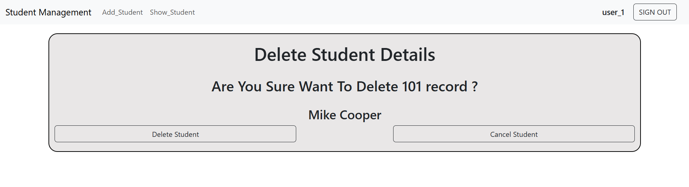

# Django Student Management System

A Django-based Student Management System built using Function-Based Views (FBV) with built-in authentication and complete CRUD operations.

---

## Features

- User Authentication (Login & Logout)
- Add Student Records
- View Student Details
- Update Student Information
- Delete Student Records
- Function-Based Views (FBV)

---

## Tech Stack

- Python
- Django
- HTML
- CSS
- Bootstrap
- MySQL

---

## Installation & Setup

### Clone Repository

```bash
git clone https://github.com/omkarpawar2002/django-student-management-system.git
```

### Move into Project Directory

```bash
cd django-student-management-system
```

### Create Virtual Environment

```bash
python -m venv venv
or 
python -m virtualenv venv
```

### Activate Virtual Environment

#### Windows

```bash
venv\Scripts\activate
```

#### Mac/Linux

```bash
source venv/bin/activate
```

### Install Dependencies

```bash
pip install -r requirements.txt
```

### Apply Migrations

```bash
python manage.py migrate
```

### Run Development Server

```bash
python manage.py runserver
```

---

## 📸 Screenshots

### 📝 Sign Up Page


### 🔐 Login Page


### ➕ Add Student - Part 1


### ➕ Add Student - Part 2


### 📋 Show Students


### ➕ Update Student - Part 1


### ➕ Update Student - Part 2


### 🗑️ Delete Student


---

## Learning Outcomes

This project helped in understanding:

- Django Authentication System
- CRUD Operations
- Function-Based Views
- Django ORM
- URL Routing
- Template Rendering

---

## 👨‍💻 Author

**Omkar Pawar**  
GitHub: [omkarpawar2002](https://github.com/omkarpawar2002)

---